# plasma-coil-fields

[](LICENSE)
[](https://www.python.org/downloads/)
[](https://github.com/uwplasma/ESSOS/pull/70)
[](https://github.com/uwplasma/pyQSC_JAX/pull/2)

Plasma self-fields and pressure response in stellarator coil design.

At finite pressure, the coils of a stellarator do not have to produce the
equilibrium magnetic field. They have to produce the equilibrium field
**minus the field of the plasma's own currents**. Near a quasisymmetric
magnetic axis that plasma field, together with its gradient and Hessian, has
a closed form. Coils can then be designed against the external field
directly, without a plasma boundary or a virtual-casing integral. This
repository holds the study built on that idea: finite-beta coil designs
checked with free-boundary equilibria, ablations, the fixed-coil pressure
displacement of the magnetic axis, and the verification of each piece.

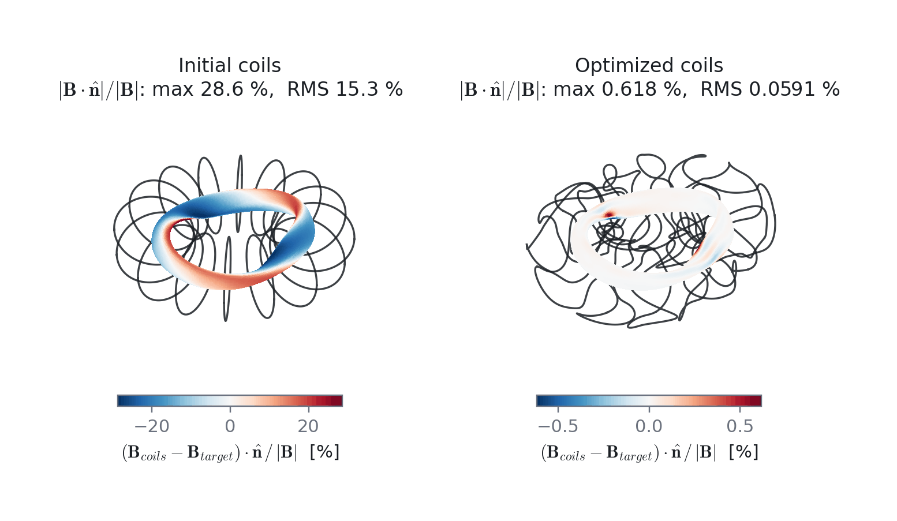

*Figure 1. Coils for a finite-pressure quasi-axisymmetric stellarator (nfp = 2,
a = 30 mm, p₂ = −6×10⁵ Pa/m², no net current), optimized together with the
near-axis equilibrium against the external field. Color: the normal field of
the coils minus the external target on the plasma boundary. The maximum drops
from 28.6% to 0.62% of |B| (RMS from 15.3% to 0.059%).*

**Contents:**
[1 Plasma field and coil target](#1-the-plasma-field-and-the-coil-target) ·
[2 Finite-pressure design](#2-a-finite-pressure-design-checked-at-free-boundary) ·
[3 Ablations](#3-ablations-what-each-ingredient-buys) ·
[4 Vacuum limit](#4-the-vacuum-limit) ·
[5 Pressure response](#5-fixed-coil-pressure-response-of-the-magnetic-axis) ·
[6 Fractional bootstrap](#6-fractional-bootstrap-current-near-the-axis) ·
[Status](#status) · [Reproduce](#reproducing-the-results) · [Layout](#repository-layout)

## 1. The plasma field and the coil target

On the magnetic axis the coils must supply

```text
B_coils = B_total − B_plasma,   ∇B_coils = ∇B_total − ∇B_plasma,   ∇∇B_coils = ∇∇B_total − ∇∇B_plasma
```

`B_plasma` is the free-space field of the Pfirsch–Schlüter, diamagnetic and
net currents inside a flux radius a. pyQSC_JAX evaluates it by matched
asymptotics from the near-axis solution. The result is a
divergence- and curl-free external target: 3 field, 5 gradient and
7 Hessian components per axis point. ESSOS fits coils to it with
`near_axis_coil_residuals`.

The Hessian matters most. The plasma part of the field is O(a²), but its
Hessian is order one: 13.9 of 14.6 T/m² here. Coils fitted to the total
field reproduce the wrong plasma shaping.

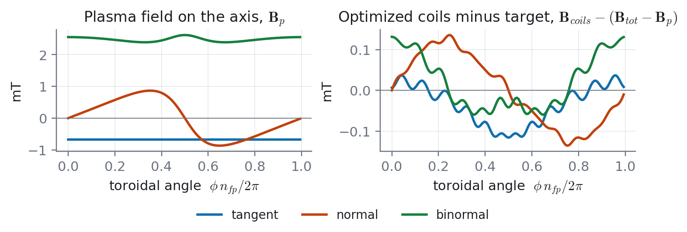

*Figure 2. Left: plasma field on the axis in the Frenet frame, 2.6 mT RMS
against B₀ = 1 T. Right: the optimized coils minus the external target,
0.12 mT RMS, 21 times below the plasma field they leave out.*

## 2. A finite-pressure design, checked at free boundary

The coils of Fig. 1 were given to VMEX as a fixed external field. VMEX
finds, with no knowledge of the near-axis target, the free-boundary
equilibrium those coils hold at the same pressure and flux.

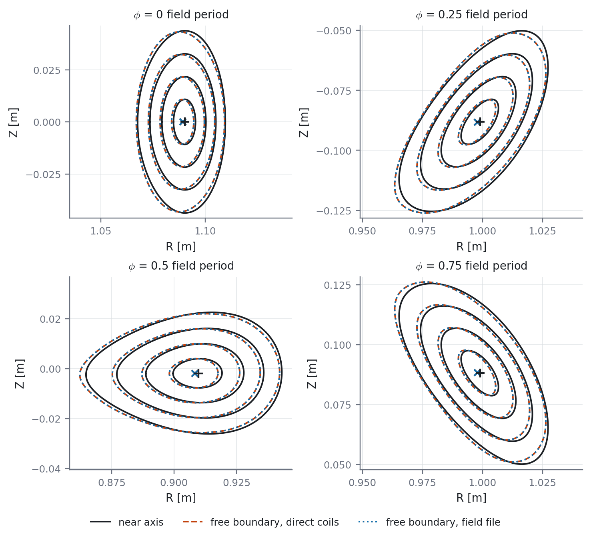

*Figure 3. Flux surfaces s = 1/16, 1/4, 9/16, 1: near-axis design (black) and
free-boundary VMEX equilibria in the optimized coils, with the coil field
evaluated directly (dashed) or through a MAKEGRID file (dotted).*

| Quantity (a = 30 mm) | Value |
|---|---|
| volume-averaged β | 6.75×10⁻⁴ |
| transform, VMEX / near-axis | −0.2099 / −0.2125 |
| boundary shape discrepancy (axis-registered, RMS) | 2.2% of a |
| raw axis offset | 5.0% of a (1.5 mm) |
| max tangential jump at the plasma–vacuum interface | 0.96% of B |
| direct coils vs MAKEGRID route | ≤ 6.5×10⁻⁴ of a |

Resolution ladder (NS 33/65/129, modes 8/10, 32/64 toroidal points,
FTOL 10⁻⁹…3×10⁻¹¹, 240/480 coil points, three field tables): the shape
discrepancy is 2.16–2.32% of a, the axis offset 4.2–5.3%, and the transform
0.2055–0.2132.

## 3. Ablations: what each ingredient buys

Same coil count, order and pressure. Only the target changes.

| Target | Boundary shape | Axis offset | Interface jump | Transform (VMEX) |
|---|---|---|---|---|
| external field, gradient and Hessian (Fig. 3) | **2.2% a** | **5.0% a** | **0.96%** | −0.210 |
| Hessian omitted | 4.8% a | 6.1% a | 4.9% | −0.209 |
| total field (no plasma subtraction) | 8.5% a | 59% a | 2.7% | −0.286 |

| Hessian omitted | Total-field target |
|---|---|
| 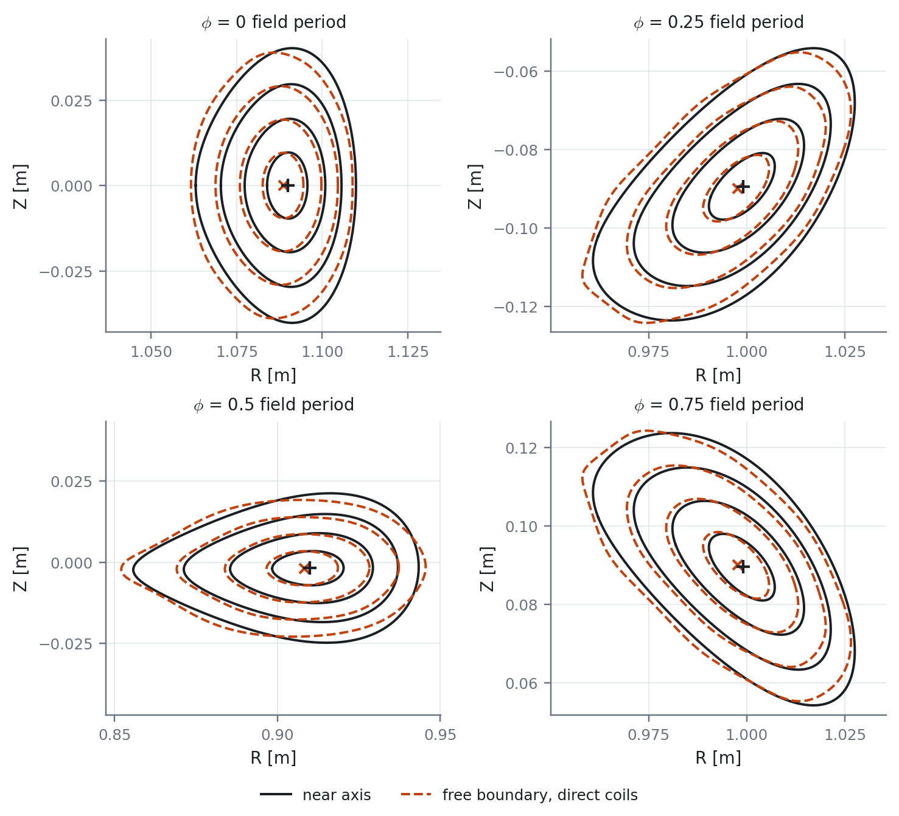 | 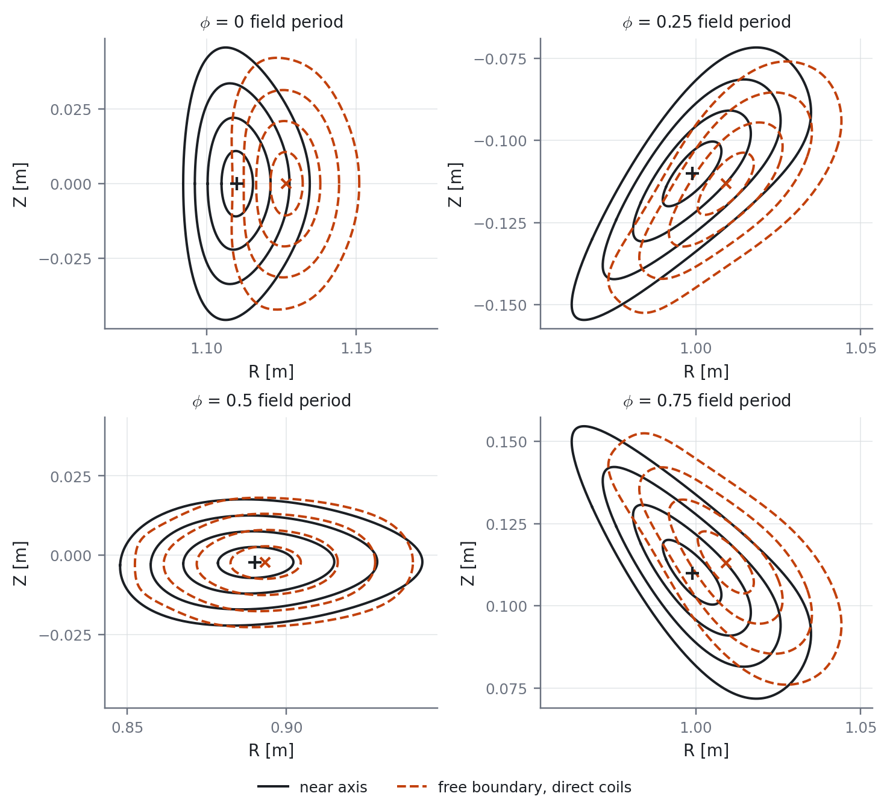 |

*Figure 4. Left: without the Hessian residual the coils reproduce the ellipse
but not the triangular shaping. Right: fitting the total field instead of the
external field moves the equilibrium off the design by more than half a
minor radius.*

## 4. The vacuum limit

With zero pressure the coil field is the total field, so field-line tracing
is an exact check.

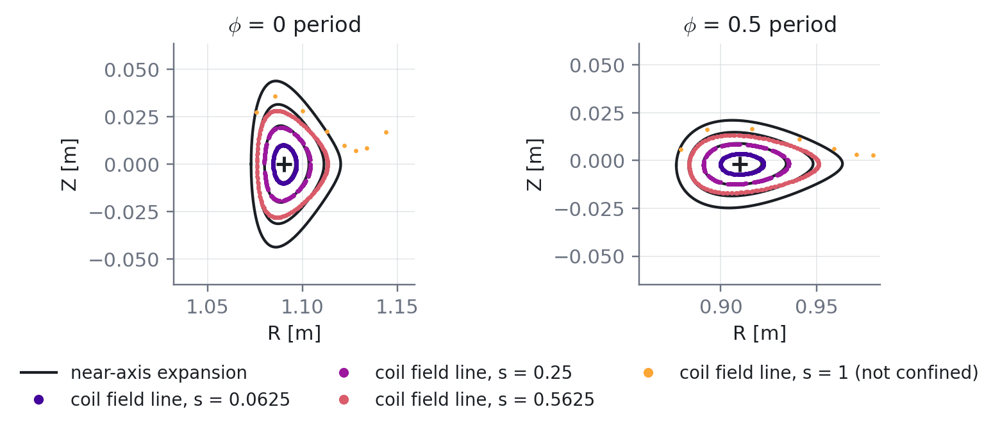

*Figure 5. Field lines of the vacuum coils against the near-axis surfaces. The
surfaces are confined out to 0.91 a. The traced transform is −0.2076, against
−0.2125 near-axis. VMEX and VMEC2000 both give −0.188 to −0.197 on the same
deck; that 5–10% gap is common to VMEC-type solvers and not yet explained.*

## 5. Fixed-coil pressure response of the magnetic axis

Adding pressure at fixed coils moves the axis. To first order, the closed
field line of B_coils + α B_plasma is displaced by the periodic solution of
the linearized field-line equation. The forcing is the on-axis plasma field
of Sec. 1. ESSOS's `pressure_axis_response` solves it for a current-free QS
axis. It returns the displacement in fixed cylindrical planes and the
first variation of axis length, which is positive on this branch.

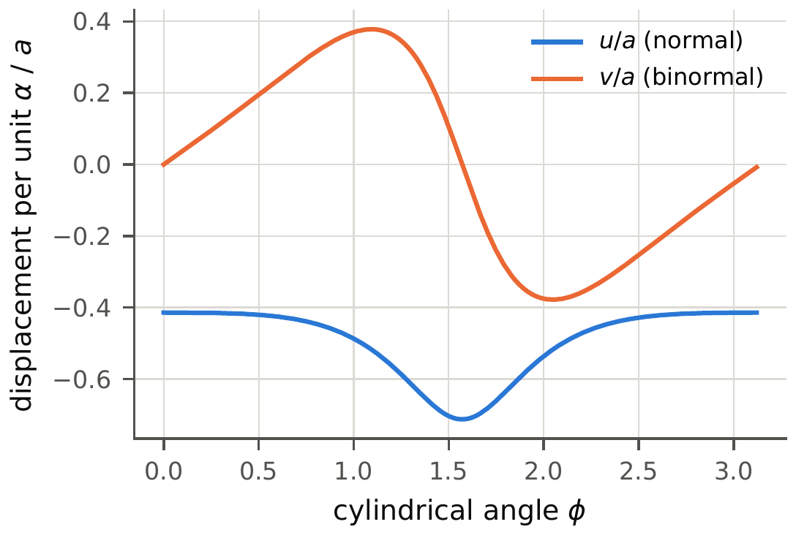

*Figure 6. First-order axis displacement per unit α for the QA axis (a = 30 mm, p₂ = −6×10⁵ Pa/m², axis β 1.4×10⁻³),
in the Frenet frame. The closed form and an independent monodromy solve
agree to 2.4×10⁻⁷, and the length slope matches its analytic formula to
2.4×10⁻⁷.*

Every piece of this prediction is verified independently of any MHD solver:

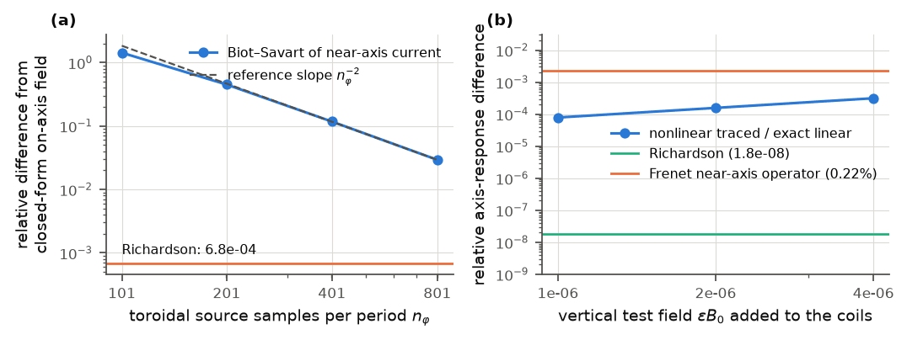

*Figure 7. (a) Biot–Savart of the near-axis current distribution converges
to the closed-form on-axis field as nφ⁻²; after Richardson extrapolation
the difference is 6.8×10⁻⁴. (b) A known vertical field added to the fitted
coils: the exact linear response on the traced axis agrees with nonlinear
tracing to 1.8×10⁻⁸. The near-axis Frenet operator agrees to 0.22%, the size
of the 82 µm offset between the ideal and traced axes.*

Free-boundary equilibria do **not** resolve this response at a = 17.8 mm and
β ~ 10⁻⁴. The predicted shift at the linearity-screen amplitude α_max is
0.52 mm:

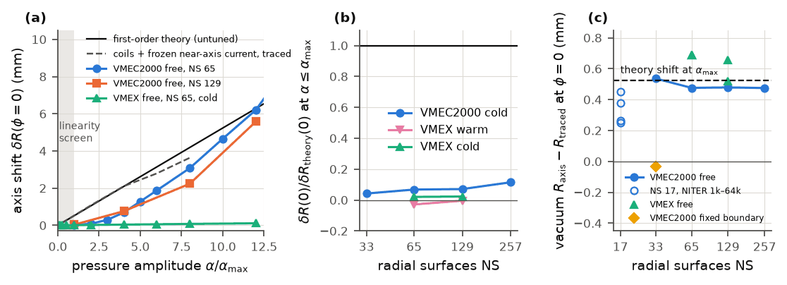

*Figure 8. (a) Axis shift against pressure. The untuned theory and the coils
traced with a frozen first-order current (linear to 2% up to 4 α_max) are
compared with free-boundary VMEC2000 (NS 65, 129) and VMEX (cold start).
(b) Response ratio at α_max against radial resolution and restart policy.
(c) Offset of the free-boundary vacuum axis from the directly traced coil
axis. Open circles: VMEC2000 with capped iteration counts. Diamond:
fixed-boundary solve. Dashed line: the predicted shift.*

| δR/δR_theory at α_max | NS 33 | NS 65 | NS 129 | NS 257 |
|---|---|---|---|---|
| VMEC2000 free, cold | 0.042 | 0.068 | 0.071 | 0.115 |
| VMEX free, warm continuation | – | −0.029 | −0.005 | – |
| VMEX free, cold | – | 0.020 | 0.023 | – |
| **vacuum-axis offset from traced coil axis (µm), VMEC2000 / VMEX** | 536 / – | 476 / 688 | 479 / 658 | 475 / – |

The sign depends on the restart policy. VMEC2000's response is non-analytic
in α and grows with its iteration count (1171 → 5165 from α_max to
12 α_max). With the iteration count capped at 1k/4k/16k/64k, the vacuum axis
wanders by 200 µm and the ratio takes the values 0.10, 0.40, 0.12 and 0.34,
all at F_sq ≤ 3×10⁻¹².

Every free-boundary vacuum axis is 0.47–0.69 mm from the traced coil axis,
as large as the signal itself. Fixed-boundary is within 33 µm; MPOL 16/NTOR 12
and a four-times finer MAKEGRID change nothing. The axis is a soft mode that
descent solvers stop before relaxing, so these equilibria cannot give the
derivative at this β. Nothing here contradicts the first-order theory, and
no full-equilibrium calculation here confirms it.

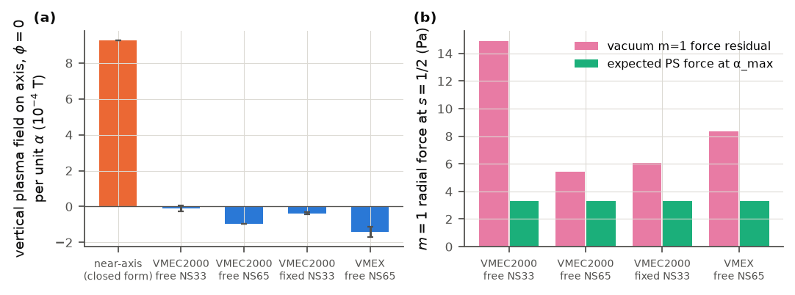

*Figure 9. (a) Vertical plasma field on the vacuum axis per unit α. The
near-axis current gives +9.3×10⁻⁴ T; the solvers' own currents (Ampère's
law on the WOUT field, differenced against their vacuum) give −0.1 to
−1.4×10⁻⁴ T. (b) The angle-resolved m = 1 radial-force residual of the vacuum
solutions (5–15 Pa) exceeds the Pfirsch–Schlüter force they must resolve
(3.3 Pa). Surface-averaged force balance holds to ≤1.3%.*

Details, all numbers and the reproduction commands:
[`shafranov_shift/results/verification/README.md`](shafranov_shift/results/verification/README.md).
A drop-in manuscript section is in
[`pressure_scan_status_revised.tex`](shafranov_shift/results/verification/pressure_scan_status_revised.tex).

## 6. Fractional bootstrap current near the axis

This is a separate, reduced problem. A collisionless bootstrap current
j∥ ∝ λ½ r^½ near a QS axis produces a non-integer transverse field
Ψ ∝ ρ^{5/2} f(γ). The mean transform coefficient is independent of the
first-order ellipse:

```text
mean_θ P = 4/25   and   ι½ = (2/5) ℓ λ½
```

The surface correction does depend on the ellipse, because P(θ) does.

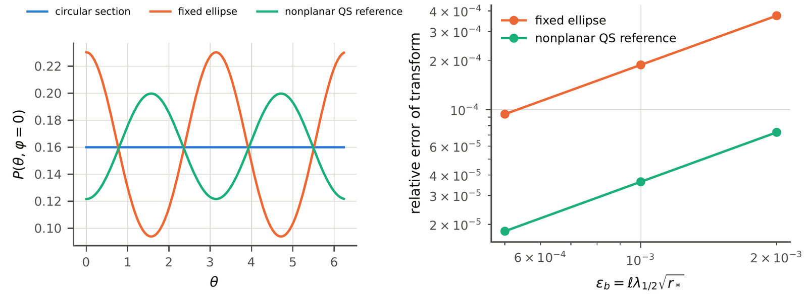

*Figure 10. Left: the angular source P(θ, φ = 0) for a circular section, a
fixed ellipse and the nonplanar QS reference; all three average to exactly
4/25. Right: direct 64-period integration of the non-averaged field-line
Hamiltonian recovers ι-coefficient 0.4 with error ∝ ε_b (9.4×10⁻⁵ and
1.9×10⁻⁵ at ε_b = 5×10⁻⁴). This verifies the reduced transverse problem. It is
not a full MHD equilibrium or a kinetic closure.*

## Status

| Result | State |
|---|---|
| Plasma field, gradient, Hessian on axis (pyQSC_JAX) | verified: volume Biot–Savart, fixed-Cartesian differences, 7 cases, 4 orientations (`validation/`) |
| External-field coil design, QA a = 30 mm | done: resolution ladder, direct and MAKEGRID routes, three ablations |
| Vacuum limit | done; the 5–10% VMEC-type transform gap is unexplained |
| First-order pressure response (theory, source, operator) | verified independently of MHD solvers |
| Fixed-coil pressure derivative from free-boundary equilibria | **unresolved**: solver path-dependent; vacuum-axis bias ≥ signal |
| QH (a = 35 mm) and stellarator–tokamak hybrid | optimizations checkpointed at 450/2000 and 600/2000 evaluations |
| Single-stage 3% β design (a = 0.1 m) | NS 17 free boundary converged (β 2.89%, ι 0.556); NS 33 open |
| Matched design and end-to-end timing comparison | not started; needs a resolved pressure derivative |

## Reproducing the results

The solvers live in their own packages. This repository has the study
drivers, compact outputs (hashes of every native WOUT) and figures.

| Package | Branch / version | Provides |
|---|---|---|
| [ESSOS](https://github.com/uwplasma/ESSOS) | `plasma-coil` ([PR #70](https://github.com/uwplasma/ESSOS/pull/70)) | coils, Biot–Savart, `near_axis_coil_targets`, `near_axis_coil_residuals`, `pressure_axis_response` |
| [pyQSC_JAX](https://github.com/uwplasma/pyQSC_JAX) | `refactor/pyqsc-jax-complete` ([PR #2](https://github.com/uwplasma/pyQSC_JAX/pull/2)) | near-axis equilibria and `pyqsc_jax.plasma` |
| [VMEX](https://github.com/uwplasma/VMEX) | v0.11.2 (`926892ab`) | free-boundary equilibria |
| VMEC2000 (optional) | STELLOPT `ee175502` | independent free-boundary check |

```bash
git clone -b plasma-coil https://github.com/uwplasma/ESSOS.git
git clone -b refactor/pyqsc-jax-complete https://github.com/uwplasma/pyQSC_JAX.git
git clone https://github.com/uwplasma/VMEX.git && git -C VMEX checkout 926892ab
git clone https://github.com/rogeriojorge/plasma-coil-fields.git && cd plasma-coil-fields
export PYTHONPATH=$PWD/../ESSOS:$PWD/../pyQSC_JAX/src:$PWD/../VMEX JAX_ENABLE_X64=1
```

```bash
pytest                                                        # plasma-field references and study checks (PYQSC_RUN_VOLUME_SWEEP=1 adds the full sweep)
python shafranov_shift/axis_operator_check.py --output runs/axis_operator_check.json   # Fig. 7b, ~4 min
python shafranov_shift/scan.py --reference shafranov_shift/reference/vacuum_fitted_reference.json \
  --output runs/qa18 --radius 0.018 --segments 480 --mpol 10 --ntor 10 --run-vmex --pressure-scan
python shafranov_shift/make_verification_figures.py           # Figs. 7-9 from the tracked JSON
cd independent_checks && python independent_checks.py && python fractional_bootstrap.py   # Figs. 6, 10
```

The Sec. 2–4 designs come from `drivers/optimize_coils_and_nearaxis_finite_beta.py`
through `run.py` (overrides), `jobs.sh` and the `*.jobs` lists. The recorded
runs are in `results.json` and the method is described in
[`archive_report.md`](archive_report.md). The full native archive (44 runs,
201 MB) is to be deposited with the paper.

## Repository layout

| Path | Contents |
|---|---|
| `docs/figures/` | the README and paper figures (compressed PNG) |
| `drivers/` | full optimization drivers (QA, QH, hybrid, single stage) and `nearaxis_finite_beta_helpers.py` (VMEX/MAKEGRID benchmarks, diagnostics, plots) |
| `run.py`, `jobs.sh`, `*.jobs`, `segments*.sh`, `adopt.py` | run orchestration for the archived designs |
| `make_tables.py`, `make_figures.py`, `replot.py`, `results.json`, `tables.tex` | tables and figures of Secs. 2–4 |
| `figures/` | full-resolution design figures, all cases |
| `investigation/` | vacuum-transform investigation and single-stage records |
| `shafranov_shift/` | pressure-response scan, reference coils, verification campaign (`results/verification/`) |
| `validation/` | heavy pyQSC_JAX plasma-field references: volume Biot–Savart, fixed-Cartesian derivatives, axis integral, Hessian identity |
| `independent_checks/` | NumPy/SciPy/SymPy checks with no repository imports, and reproduction logs |
| `tests/` | study checks: VMEX pressure-family deck, circular-tokamak reference |
| `paper.mplstyle` | shared figure style |

## License

MIT. The material was developed in the ESSOS repository and moved here
with its history.
