# plasma-coil-fields

[](LICENSE)
[](https://www.python.org/downloads/)
[](https://github.com/uwplasma/ESSOS/pull/70)
[](https://github.com/uwplasma/pyQSC_JAX/pull/2)

Plasma self-fields and pressure response in stellarator coil design.

At finite pressure, the coils of a stellarator do not have to produce the
equilibrium magnetic field. They have to produce the equilibrium field
**minus the field of the plasma's own currents**. Near a quasisymmetric
magnetic axis that plasma field, together with its gradient and Hessian, has
a closed form. Coils can then be designed against the external field
directly, without a plasma boundary or a virtual-casing integral. This
repository holds the study built on that idea: finite-beta coil designs
checked with free-boundary equilibria, ablations, the fixed-coil pressure
displacement of the magnetic axis, and the verification of each piece.


*Figure 1. Coils for a finite-pressure quasi-axisymmetric stellarator (nfp = 2,
a = 30 mm, p₂ = −6×10⁵ Pa/m², no net current), optimized together with the
near-axis equilibrium against the external field. Color: the normal field of
the coils minus the external target on the plasma boundary. The maximum drops
from 28.6% to 0.62% of |B| (RMS from 15.3% to 0.059%).*

**Contents:**
[1 Plasma field and coil target](#1-the-plasma-field-and-the-coil-target) ·
[2 Finite-pressure design](#2-a-finite-pressure-design-checked-at-free-boundary) ·
[3 Ablations](#3-ablations-what-each-ingredient-buys) ·
[4 Vacuum limit](#4-the-vacuum-limit) ·
[5 Maximum free-boundary radius](#5-largest-free-boundary-radius-of-every-design) ·
[6 QH, hybrid, single stage](#6-qh-hybrid-and-single-stage-examples) ·
[7 pyQSC_JAX validation](#7-pyqsc_jax-validation) ·
[8 Fractional bootstrap](#8-fractional-bootstrap-current-near-the-axis) ·
[9 Pressure response](#9-fixed-coil-pressure-response-of-the-magnetic-axis) ·
[Status](#status) · [Reproduce](#reproducing-the-results) · [Layout](#repository-layout)

## 1. The plasma field and the coil target

On the magnetic axis the coils must supply

```text
B_coils = B_total − B_plasma,   ∇B_coils = ∇B_total − ∇B_plasma,   ∇∇B_coils = ∇∇B_total − ∇∇B_plasma
```

`B_plasma` is the free-space field of the Pfirsch–Schlüter, diamagnetic and
net currents inside a flux radius a. pyQSC_JAX evaluates it by matched
asymptotics from the near-axis solution. The result is a
divergence- and curl-free external target: 3 field, 5 gradient and
7 Hessian components per axis point. ESSOS fits coils to it with
`near_axis_coil_residuals`.

The Hessian matters most. The plasma part of the field is O(a²), but its
Hessian is order one: 13.9 of 14.6 T/m² here. Coils fitted to the total
field reproduce the wrong plasma shaping.

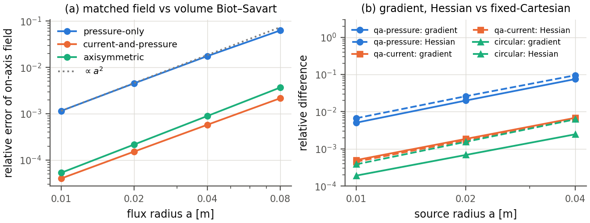

*Figure 2a. (a) The matched on-axis plasma field against the unexpanded volume Biot–Savart
integral of the near-axis current, three cases: the error falls as a² (1.2×10⁻³ at a = 10 mm
for the pressure-only QA case). (b) Gradient and Hessian against fixed-Cartesian central
differences of the same volume field: also O(a²), 5×10⁻³ and 7×10⁻³ at a = 10 mm for the QA
pressure case. Data: `volume_table.json`, `cartesian_table.json` (`validation/`);
figure: `plot_plasma_field_verification.py`.*


*Figure 2. Left: plasma field on the axis in the Frenet frame, 2.6 mT RMS
against B₀ = 1 T. Right: the optimized coils minus the external target,
0.12 mT RMS, 21 times below the plasma field they leave out.*

## 2. A finite-pressure design, checked at free boundary

The coils of Fig. 1 were given to VMEX as a fixed external field. VMEX
finds, with no knowledge of the near-axis target, the free-boundary
equilibrium those coils hold at the same pressure and flux.


*Figure 3. Flux surfaces s = 1/16, 1/4, 9/16, 1: near-axis design (black) and
free-boundary VMEX equilibria in the optimized coils, with the coil field
evaluated directly (dashed) or through a MAKEGRID file (dotted).*

| Quantity (a = 30 mm) | Value |
|---|---|
| volume-averaged β | 6.75×10⁻⁴ |
| transform, VMEX / near-axis | −0.2099 / −0.2125 |
| boundary shape discrepancy (axis-registered, RMS) | 2.2% of a |
| raw axis offset | 5.0% of a (1.5 mm) |
| max tangential jump at the plasma–vacuum interface | 0.96% of B |
| direct coils vs MAKEGRID route | ≤ 6.5×10⁻⁴ of a |

Resolution ladder (NS 33/65/129, modes 8/10, 32/64 toroidal points,
FTOL 10⁻⁹…3×10⁻¹¹, 240/480 coil points, three field tables): the shape
discrepancy is 2.16–2.32% of a, the axis offset 4.2–5.3%, and the transform
0.2055–0.2132.

## 3. Ablations: what each ingredient buys

Same coil count, order and pressure. Only the target changes.

| Target | Boundary shape | Axis offset | Interface jump | Transform (VMEX) |
|---|---|---|---|---|
| external field, gradient and Hessian (Fig. 3) | **2.2% a** | **5.0% a** | **0.96%** | −0.210 |
| Hessian omitted | 4.8% a | 6.1% a | 4.9% | −0.209 |
| total field (no plasma subtraction) | 8.5% a | 59% a | 2.7% | −0.286 |

| Hessian omitted | Total-field target |
|---|---|
|  |  |

*Figure 4. Left: without the Hessian residual the coils reproduce the ellipse
but not the triangular shaping. Right: fitting the total field instead of the
external field moves the equilibrium off the design by more than half a
minor radius.*

## 4. The vacuum limit

With zero pressure the coil field is the total field, so field-line tracing
is an exact check.


*Figure 5. Field lines of the vacuum coils against the near-axis surfaces. The
surfaces are confined out to 0.91 a. The traced transform is −0.2076, against
−0.2125 near-axis. VMEX gives −0.188 on axis (FTOL 10⁻¹⁰).*

The 5–10% transform gap is a property of VMEC-type solvers in this zero-pressure,
zero-current case, not of the coils (`investigation/`, `archive_report.md`):

- VMEX surfaces are coil-field surfaces: |B·n|/|B| ≤ 5×10⁻⁴ at s = 1/16, < 0.5% everywhere
  (`V_ftol_vacuum_iota.json`).
- The coil field on those same surfaces, ⟨√g B^u⟩/⟨√g B^v⟩, gives −0.211 to −0.197, and lines
  traced from them −0.209 to −0.202; the near-axis value is −0.2125. VMEX gives −0.188 to −0.177
  on the same surfaces (`V_ftol_direct_vacuum_iota.json`).
- VMEC2000 on the identical runtime deck and MAKEGRID file reproduces VMEX: −0.196 / −0.188 on
  axis and at s = 1/2, against VMEX's −0.197 / −0.188 (`vacuum_mgrid_vmec2000_vacuum_iota.json`).
- At 12 modes the VMEC iota moves further (−0.089 on axis), so it is not Fourier-converged.
  The finite-pressure transforms agree to about 1%. The mechanism inside the solvers is not identified.

## 5. Largest free-boundary radius of every design

Each design's coils were held fixed and the VMEX boundary radius a_b was scanned upward from the
known converged radii in steps of 0.25 a, with one bisection between the last converged and the
first failed radius (`max_radius.py`, `max_radius_scan.json`). A solve counts only at NS 65 and
FTOL 10⁻¹⁰ with the vacuum region active (single stage: FTOL 10⁻⁹, the setting that converged
at a_b = a; its FTOL 10⁻¹⁰ solve stalls at 5×10⁻¹⁰). Nothing was loosened. **p₂ is fixed, so the
central pressure grows as a_b².** Every job was capped at 600 s; the vacuum solves at
0.85 a and 1.0 a hit that cap rather than stalling (at FTOL ~10⁻⁷, 1.0 a converges).
New solves use VMEX `b68807d8d`; reused ones are those of Secs. 2–4 and 6.

The equilibrium at the largest converged a_b is compared with the near-axis surfaces at
r = a_b √s, s = 1/16, 1/4, 9/16, 1 (`max_radius_results.json`). "Raw" is the RMS distance
between equal-flux contours in every axis plane; "shape" moves each near-axis surface onto
VMEX's own axis first. Both are divided by the flux radius. "On-branch" is the largest converged
a_b whose axis stays within 10% of a_b: beyond it the solver converges to a different equilibrium.

| Design | max a_b | first failed | setting | on-branch max | axis offset / a_b | shape % (s = 1/16 / 1/4 / 9/16 / 1) | raw % | ι lab, VMEX axis / near axis |
|---|---|---|---|---|---|---|---|---|
| QA finite beta (a = 30 mm) | **1.5 a** (45.0 mm) | 1.625 a | NS 65, FTOL 1e-10 | 1.25 a | 23.6% | 2.0 / 1.9 / 2.2 / 3.4 | 50 / 26 / 17 / 14 | -0.185 / -0.212 |
| Hessian omitted | **1 a** (30.0 mm) | 1.125 a | NS 65, FTOL 1e-10 | 1 a | 6.1% | 0.9 / 1.8 / 3.1 / 4.8 | 13 / 7 / 6 / 6 | -0.209 / -0.213 |
| total-field control | **1.125 a** (33.8 mm) | 1.25 a | NS 65, FTOL 1e-10 | none | 51.4% | 4.9 / 5.6 / 6.5 / 7.4 | 105 / 51 / 38 / 30 | -0.310 / -0.345 |
| vacuum QA | **0.7 a** (21.0 mm) | 0.85 a | NS 65, FTOL 1e-10 | 0.7 a | 3.0% | 2.4 / 2.6 / 3.1 / 4.0 | 6 / 4 / 3 / 4 | -0.188 / -0.213 |
| axisymmetric | **2.875 a** (86.2 mm) | 3 a | NS 65, FTOL 1e-10 | 1.5 a | 117.8% | 30.5 / 30.0 / 29.2 / 28.3 | 402 / 182 / 118 / 91 | -0.325 / -0.400 |
| QH (nfp 4) | **3.375 a** (118.1 mm) | 3.5 a | NS 65, FTOL 1e-10 | 2.75 a | 14.7% | 8.4 / 11.4 / 14.8 / 17.5 | 33 / 20 / 19 / 20 | +1.112 / +1.144 |
| hybrid (nfp 3) | **1.25 a** (50.0 mm) | 1.375 a | NS 65, FTOL 1e-10 | 1 a | 28.7% | 6.7 / 7.2 / 8.0 / 9.2 | 54 / 28 / 20 / 17 | -0.663 / -0.713 |
| single stage (well margin) | **1 a** (100.0 mm) | 1.125 a | NS 65, FTOL 1e-09 | 1 a | 1.3% | 2.8 / 8.8 / 19.0 / 19.8 | 5 / 9 / 19 / 20 | +0.457 / +0.474 |

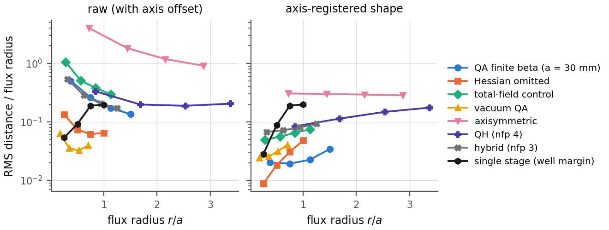

*Figure 5a. RMS contour distance over flux radius at the largest converged a_b of each design,
against flux radius r/a.*

| | |
|---|---|
| QA, a_b = 1.5 a 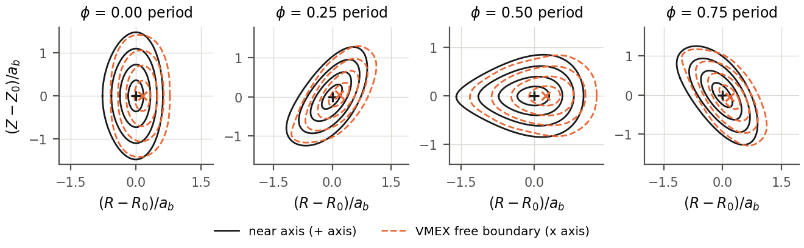 | Hessian omitted, a_b = a 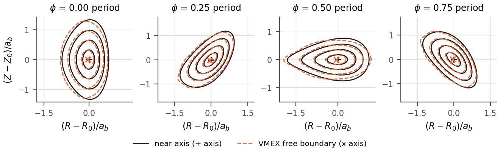 |
| total-field control, a_b = 1.125 a 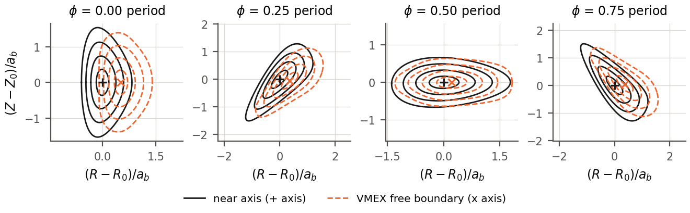 | vacuum, a_b = 0.7 a 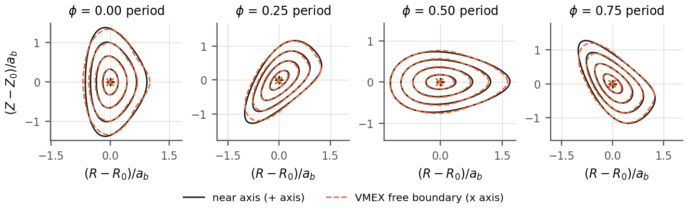 |
| axisymmetric, a_b = 2.875 a 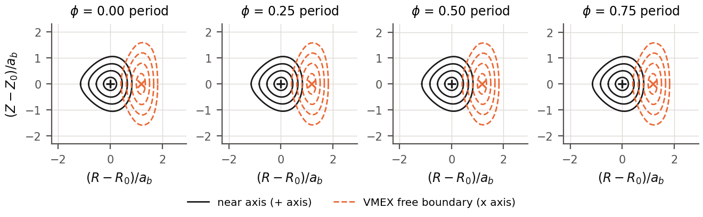 | QH, a_b = 3.375 a 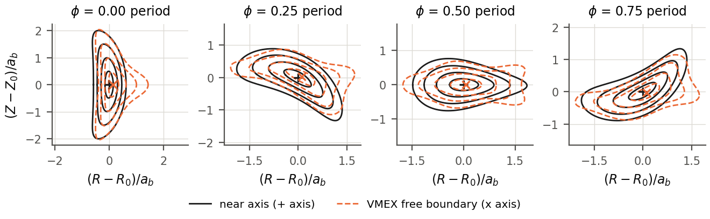 |
| hybrid, a_b = 1.25 a 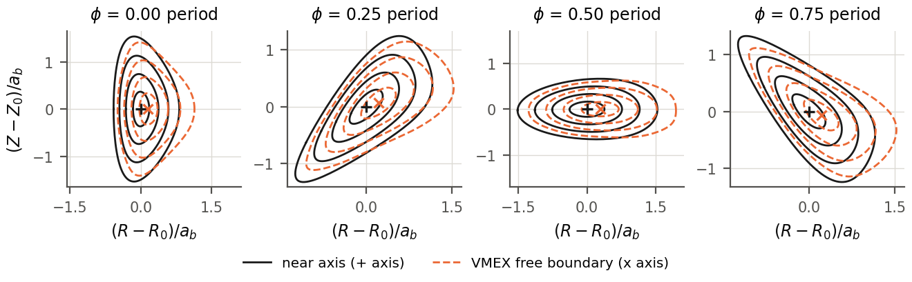 | single stage, a_b = a 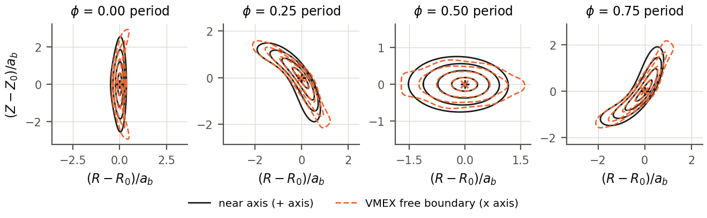 |

*Figure 5b. Near-axis surfaces (solid, + axis) and VMEX (dashed, × axis) in four toroidal
planes, in units of a_b about the near-axis axis.*

Findings. The QH coils hold nested surfaces out to 3.375 a, and stay on the design branch
(axis ≤ 10% of a_b) to 2.75 a. The flagship QA converges to 1.5 a, but at 1.5 a the axis sits
24% of a_b away (1.25 a is on-branch: axis 0.5%, shape 3.7%). The axisymmetric coils converge to
2.875 a, but from 1.75 a on to an equilibrium displaced outward by one a_b or more. The
Hessian-omitted, control, hybrid and single-stage coils do not converge beyond a–1.25 a.

## 6. QH, hybrid and single-stage examples

Three further designs, run with the drivers in `drivers/` and VMEX main
`204c8a9c` (0.11.4). All numbers are in [`examples_results.json`](examples_results.json),
written by `collect_examples.py` from the run directories (WOUT files are
not tracked; their sha256 is recorded there). The first-pass results are kept
unchanged under `first_pass` in the same file. Coil metrics are evaluated at
480 points per coil. Free-boundary equilibria use the direct coil field.

**Second pass: coil limits.** The first pass hinged length and curvature only at the
Biot-Savart quadrature points and had no distance terms. A kink grew between the samples of a
single-stage coil (curvature 9.8 m⁻¹ at 60 points, 7778 m⁻¹ at 480), and the QH and hybrid coils
passed 4–7 mm from each other. Now length, curvature, mean-squared curvature (MSC) and
arclength variation are evaluated on 16 points per Fourier order. Coil–coil and coil–plasma
distance terms were added. The QH and hybrid fits run 1600 evaluations with soft limits
(weight 1), then 400 at weight 100, then 400 more at weight 100 with the distance terms at 24
points per order. The earlier attempts with near-hard limits from the start stalled and are
recorded under `abandoned_runs`.

**QH boundary error (the remedy).** In the first pass, B·n/|B| on r = a rose from 1.3% to
4.2% while the axis match improved. That fit had no coil–plasma distance term: the coils ended
8 mm from each other and 83 mm from the plasma, where the field content beyond the fitted
quadratic jet is large. The remedy stays within the method: stronger coil regularization
(coil–plasma ≥ 0.10 m, coil–coil ≥ 0.05 m, MSC ≤ 50 m⁻², curvature evaluated at 16 points per
order). The objective is still the axis jet only, and B·n is only a diagnostic
(`trajectory` in the JSON, one row per segment). With the regularization, max B·n/|B| drops to
0.77% by 900 evaluations and stays within 0.77–0.79% to 2000. It is 0.68% after the limit phase.

| | QH (nfp 4, a = 35 mm, p₂ = −1.76×10⁶ Pa/m²) | Hybrid (nfp 3, a = 40 mm, I₂ = 0.4 T/m, p₂ = −6×10⁵ Pa/m²) |
|---|---|---|
| coils − target on axis: field / B₀, gradient R₀/B₀, Hessian R₀²/B₀ | 3.4×10⁻⁴ / 4.3×10⁻³ / 0.28 (target 39) | 7.2×10⁻⁴ / 2.3×10⁻³ / 0.16 (target 27) |
| B·n/\|B\| on r = a, max / RMS (first pass) | 0.68% / 0.16% (4.19% / 0.55%) | 1.29% / 0.21% (1.05% / 0.16%) |
| coil length, curvature max (limit), MSC max | 3.63 m, 12.08 m⁻¹ (12), 49.2 m⁻² | 3.49 m, 12.13 m⁻¹ (12), 49.2 m⁻² |
| min coil–coil / coil–plasma (limits 0.05 / 0.10 m; first pass) | 0.050 / 0.131 m (0.004 / 0.083) | 0.050 / 0.100 m (0.007 / 0.092) |
| ι lab, VMEX / near axis (a_b = a) | 1.1396 / 1.1441 (first pass 1.118) | −0.708 / −0.713 |
| free boundary converged (NS 65, FTOL 10⁻¹⁰) at a_b = | a, 1.25a, 1.5a, 2a | a, 1.25a |
| axis offset max / a_b, at a, 1.25a, 1.5a, 2a | 0.7%, 1.9%, 3.3%, 5.3% | 6.1%, 29% |
| LCFS shape RMS / a_b, same | 0.57%, 0.89%, 1.5%, 6.3% (first pass 5.3, 9.2, 13, –) | 3.3%, 9.2% |
| tangential interface jump max / \|B\|, same | 0.7%, 0.9%, 1.0%, 1.6% | 0.9%, 1.3% |

The QH free-boundary agreement is an order of magnitude better than in the first pass, and the
full ladder converges out to 2a. The hybrid matches the first pass. At 1.5a it stalls at
1×10⁻⁸ (NS 33, FTOL 10⁻⁹, DELT 0.25) and at 3×10⁻⁶ (NS 65). At 2a it stalls at 2×10⁻⁷. The coils
satisfy their limits at 480 points (curvature 1% over through the smooth hinge), but they are
wavy (`figures/examples/*_coils_and_normal_field.png`), because a curvature limit of 12 m⁻¹ on 3.5 m coils still allows that.


*Figure 11. Converged free-boundary equilibria of the QH and hybrid coils against the boundary radius.*

**Single stage (nfp 2, a = 0.1 m, near-axis ⟨β⟩ = μ₀p₀/B₀² = 3.00%).** Axis harmonics up to n = 6
are free. Mercier stability, D_Merc r² ≥ 0, cannot be met together with quasisymmetry in this
family at 3% β (`single_stage_mercier_scan.py`/`.json`: a hard Mercier hinge raises the B₂₀
variation from 4×10⁻⁴ to 0.47 at a = 0.1 m and breaks the r_singularity, elongation and ι
limits). At a = 0.15 m it is compatible, but the r = a surface then reaches 0.56 m from the axis and
folds (run abandoned). The design therefore keeps a magnetic-well margin D_Well r² ≥ 1 as a
near-hard hinge, plus a weak Mercier term. **The magnetic well is the accepted stability
substitute for Mercier in this example**; its Mercier value is stated as a limitation:

- ⟨β⟩ 3.00%, ι 0.474, B₂₀ variation 0.0165 B₀/R₀² (first pass 0.016), r_singularity 1.51a, elongation 6.00;
- D_Well r² = 1.17; **D_Merc r² = −0.97** (first pass −2.35): still Mercier-unstable near the axis;
- coils at 480 points: length 4.91 m (limit 5), curvature 6.00 m⁻¹ (limit 6), MSC 9.6 m⁻² (limit 10), coil–plasma
  0.197 m (limit 0.2), coil–coil **0.083 m** (limit 0.1; the driver's distance term uses the 60 Biot–Savart points);
- B·n/|B| on r = a: max 21.7%, RMS 3.0% (first pass 7.1% / 1.3%). The coils are loopy (`single_stage_coils_and_normal_field.png`);
- free boundary: NS 17 converged at FTOL 10⁻¹⁰. At NS 33 and 65, FTOL 10⁻¹⁰ stalls (5×10⁻¹⁰–1.5×10⁻⁹, with ι
  drifting at NS 33), so they converged at FTOL 10⁻⁹. DELT 0.25 was not needed. VMEX betatotal 2.91%;
- on-axis ι: 0.500 / 0.475 / 0.457 at NS 17 / 33 / 65, against 0.474 near axis (first pass 0.556–0.617 against 0.417).
  It is **not resolution-converged**: it falls by about 0.02 per NS doubling;
- axis offset 2.6 / 1.6 / 1.3% of a (first pass 19%); LCFS shape 18–20% of a; tangential jump 13%.


*Figure 12. On-axis transform of the single-stage free-boundary equilibria against NS.*

## 7. pyQSC_JAX validation

The near-axis solver's own checks (`pyqsc_jax_validation/`, where each figure has a JSON of the
plotted numbers and versions; see its README).

| | |
|---|---|
| 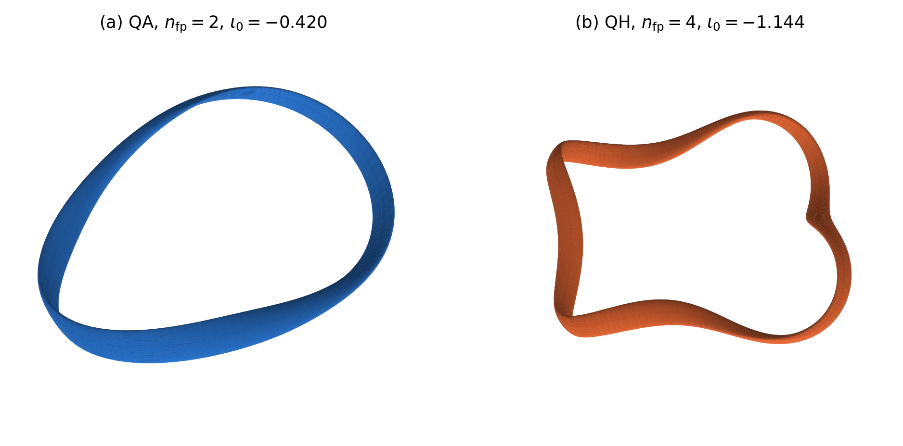 QA and QH surfaces (Landreman & Sengupta 2019) | 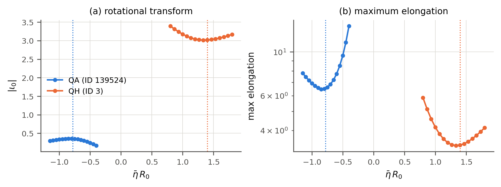 ι₀ and elongation against η̄ |
| 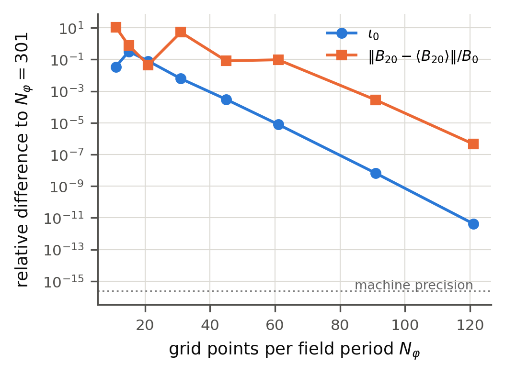 ι₀ converges spectrally in N_φ; B₂₀ more slowly | 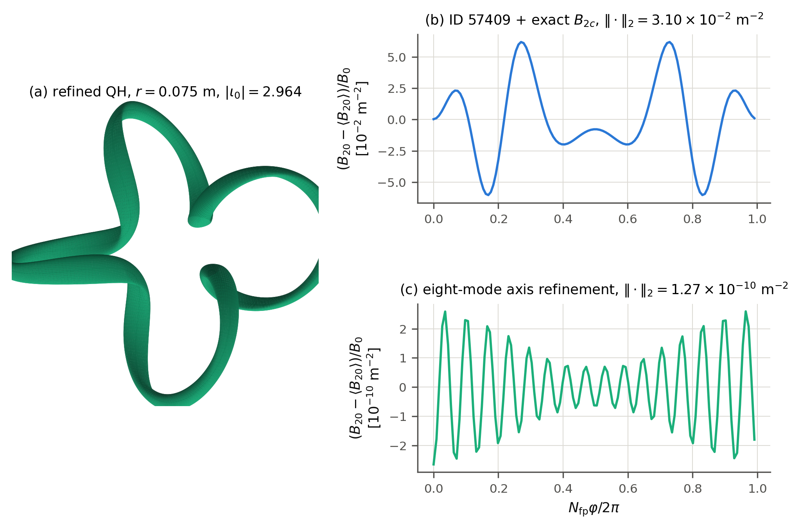 B₂₀ flattening: exact B2c 3.1×10⁻², 8-mode refinement 1.3×10⁻¹⁰ m⁻² |
| 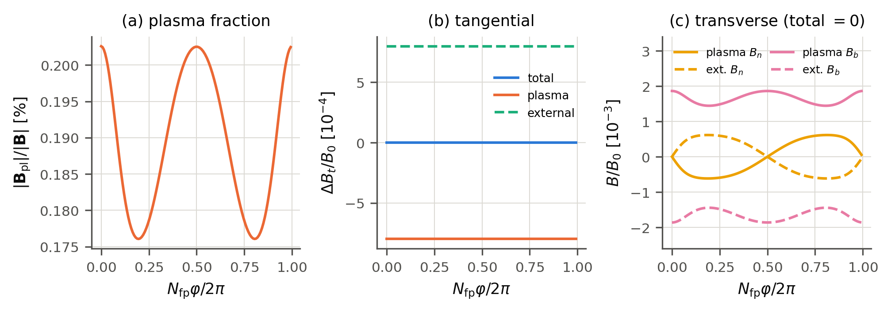 plasma/external split of the on-axis field (plasma ≈ 0.2%) | 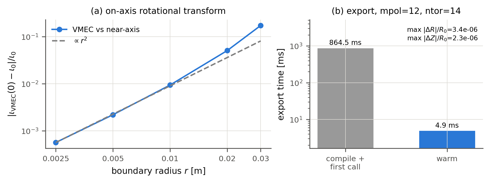 VMEC on-axis ι error ∝ r²; export 4.9 ms warm |
| 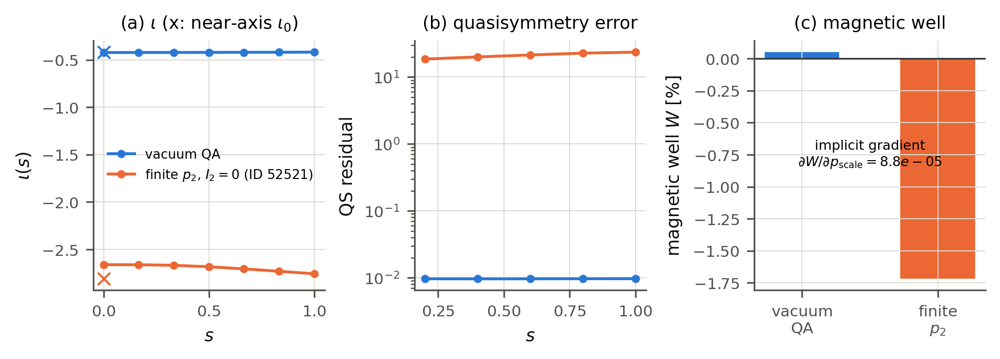 VMEX fixed-boundary ι(s), QS residual, well | 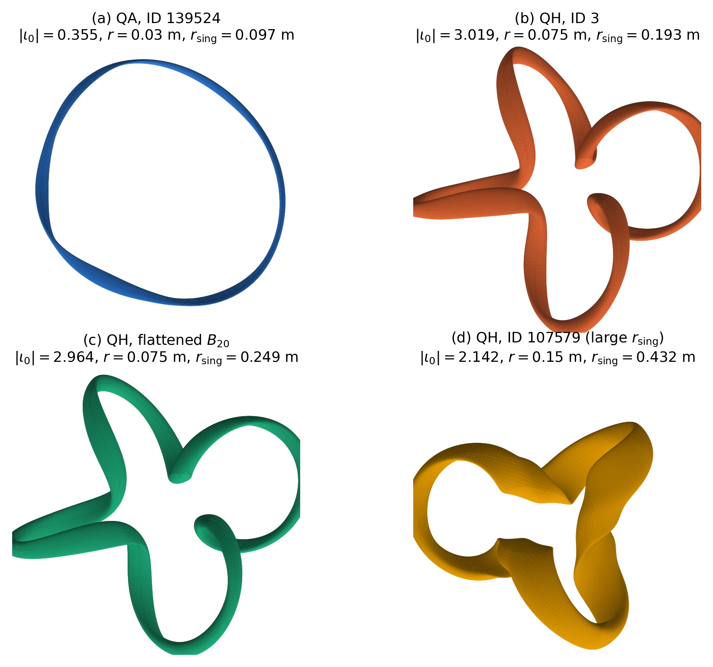 four screened designs |
| 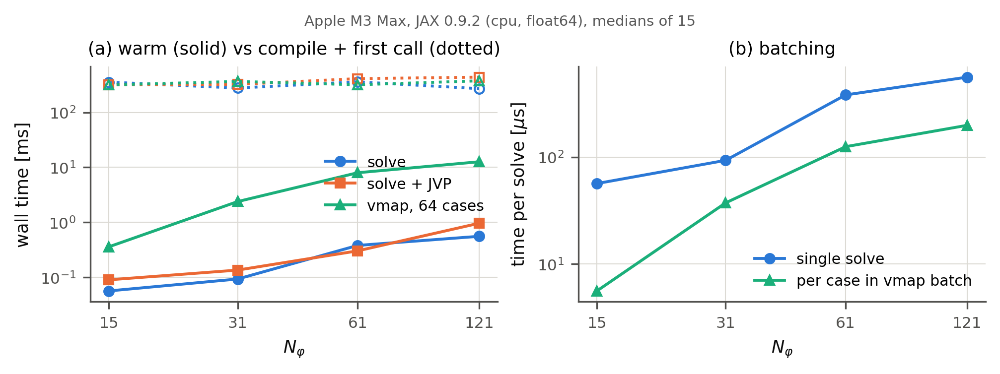 solve 0.56 ms warm at N = 121 | 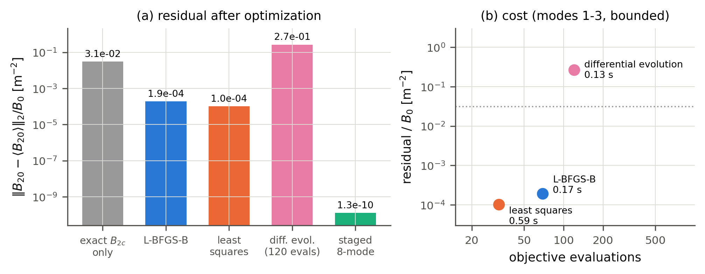 B₂₀ optimizers compared |

## 8. Fractional bootstrap current near the axis

This is a separate, reduced problem. A collisionless bootstrap current
j∥ ∝ λ½ r^½ near a QS axis produces a non-integer transverse field
Ψ ∝ ρ^{5/2} f(γ). The mean transform coefficient is independent of the
first-order ellipse:

```text
mean_θ P = 4/25   and   ι½ = (2/5) ℓ λ½
```

The surface correction does depend on the ellipse, because P(θ) does.


*Figure 10. Left: the angular source P(θ, φ = 0) for a circular section, a
fixed ellipse and the nonplanar QS reference; all three average to exactly
4/25. Right: direct 64-period integration of the non-averaged field-line
Hamiltonian recovers ι-coefficient 0.4 with error ∝ ε_b (9.4×10⁻⁵ and
1.9×10⁻⁵ at ε_b = 5×10⁻⁴). This verifies the reduced transverse problem. It is
not a full MHD equilibrium or a kinetic closure.*

## 9. Fixed-coil pressure response of the magnetic axis

Adding pressure at fixed coils moves the axis. To first order, the closed
field line of B_coils + α B_plasma is displaced by the periodic solution of
the linearized field-line equation. The forcing is the on-axis plasma field
of Sec. 1. ESSOS's `pressure_axis_response` solves it for a current-free QS
axis. It returns the displacement in fixed cylindrical planes and the
first variation of axis length, which is positive on this branch.


*Figure 6. First-order axis displacement per unit α for the QA axis (a = 30 mm, p₂ = −6×10⁵ Pa/m², axis β 1.4×10⁻³),
in the Frenet frame. The closed form and an independent monodromy solve
agree to 2.4×10⁻⁷, and the length slope matches its analytic formula to
2.4×10⁻⁷.*

Every piece of this prediction is verified independently of any MHD solver:


*Figure 7. (a) Biot–Savart of the near-axis current distribution converges
to the closed-form on-axis field as nφ⁻²; after Richardson extrapolation
the difference is 6.8×10⁻⁴. (b) A known vertical field added to the fitted
coils: the exact linear response on the traced axis agrees with nonlinear
tracing to 1.8×10⁻⁸. The near-axis Frenet operator agrees to 0.22%, the size
of the 82 µm offset between the ideal and traced axes.*

**A free-boundary equilibrium confirms it.** With p = p₀(1 − s) the on-axis
plasma field is proportional to p₂a_b² = −p₀, so the predicted displacement
depends on the on-axis β only. On the QH coils of Sec. 6 (a_b = 35 mm,
a_b/R₀ = 0.029, ι = 1.14), VMEX continued from its default ladder to
FTOL 10⁻¹⁵ gives

**VMEX / first-order theory = 1.037 ± 0.022**

for the axis displacement per unit β, linear over β = 6.75×10⁻⁴ to 1.08×10⁻²
(displacement 0.26% to 4.1% of a_b; the quadratic term is 1.9% at the top).
The uncertainty is measured: restart policy 0.3%, MPOL 12 and NS 129 1.5%,
traced-axis vs ideal near-axis operator 1.5%, fit 0.1%.

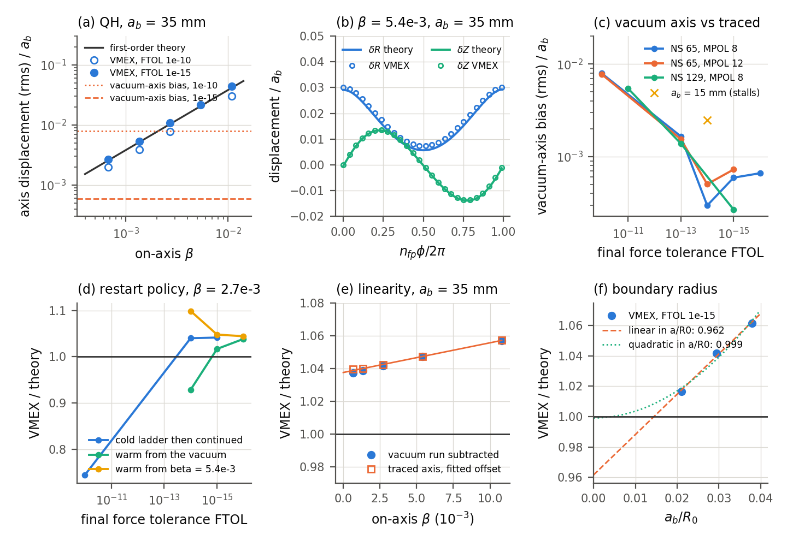

*Figure 8. QH coils, fixed, p = p₀(1 − s), zero current. (a) rms axis displacement / a_b
against on-axis β: first-order theory, VMEX at the default FTOL 10⁻¹⁰ (open) and continued
to 10⁻¹⁵ (filled), and the vacuum-axis bias at the two tolerances. (b) δR and δZ along the
field period at β = 5.4×10⁻³. (c) Vacuum-axis bias against the directly traced coil axis vs
FTOL. (d) Response ratio for three restart policies vs FTOL. (e) Response ratio across the
β ladder, vacuum-subtracted and from the traced axis with a fitted offset. (f) Response
ratio against a_b/R₀, with linear and quadratic extrapolations to a_b = 0.*

What controls it is the force tolerance, and the axis stiffness behind it. The
axis position is the softest direction of the free-boundary energy. At VMEX's
default FTOL 10⁻¹⁰ the QH vacuum axis sits 278 µm (0.8% a_b) from the traced
coil axis and the response is only 0.73–0.77 of theory at every β; more modes
or surfaces do not change that. At 10⁻¹⁴–10⁻¹⁶ the bias is 10–23 µm, 1.4–6% of
the signal at β ≥ 2.7×10⁻³. Restarts that approach from below (the vacuum) and
from above (β = 5.4×10⁻³) differ by 17% at 10⁻¹⁴ and agree with the cold path
to ±0.3% at 10⁻¹⁶.

| a_b (mm) | a_b/R₀ | β | VMEX/theory | vacuum bias (µm) |
|---|---|---|---|---|
| 25 | 0.021 | 1.38×10⁻³ | 1.017 | 9 |
| 35 | 0.029 | 6.75×10⁻⁴ – 1.08×10⁻² | 1.037 (fit) | 10–23 |
| 45 | 0.038 | 4.46×10⁻³ | 1.061 | 55 |
| 15 | 0.013 | 2.7×10⁻³ | not converged (residual floor 7×10⁻¹⁴) | 37 |

The excess over 1 grows with a_b and extrapolates to 0.96 (linear in a_b) or
1.00 (quadratic) at a_b → 0, where the near-axis theory applies. The earlier
QA benchmark (a = 17.8 mm, ι = 0.21, aspect ratio 61) failed for the same
reason as the 15 mm QH: the solver's residual floors before the soft axis mode
relaxes. There every free-boundary vacuum axis sat 0.47–0.69 mm from the traced
coil axis with VMEX and VMEC2000, and the response depended on restarts and
iteration counts (details and figures in
[`shafranov_shift/results/verification/README.md`](shafranov_shift/results/verification/README.md)).

Numbers, protocol, run records and reproduction:
[`shafranov_shift/results/pressure_benchmark/README.md`](shafranov_shift/results/pressure_benchmark/README.md).

## Status

| Result | State |
|---|---|
| Plasma field, gradient, Hessian on axis (pyQSC_JAX) | verified: volume Biot–Savart, fixed-Cartesian differences, 7 cases, 4 orientations (`validation/`) |
| External-field coil design, QA a = 30 mm | done: resolution ladder, direct and MAKEGRID routes, three ablations |
| Vacuum limit | done; the 5–10% VMEC-type transform gap is a solver effect (coil field on VMEX surfaces and traced lines match near axis; VMEC2000 reproduces VMEX); mechanism not identified |
| Largest free-boundary radius, all eight designs | done (Sec. 5): QA 1.5 a (on-branch 1.25 a), QH 3.375 a, axisymmetric 2.875 a (on-branch 1.5 a), hybrid 1.25 a, control 1.125 a, Hessian-omitted and single stage a, vacuum 0.7 a (600 s cap) |
| First-order pressure response (theory, source, operator) | verified independently of MHD solvers |
| Fixed-coil pressure derivative from free-boundary equilibria | **resolved on the QH coils** (Sec. 9): VMEX/theory 1.037 ± 0.022 at a_b = 35 mm, linear over β 6.75×10⁻⁴–1.08×10⁻², restart-independent at FTOL 10⁻¹⁵; 1.017–1.061 over a_b = 25–45 mm, extrapolating to 0.96–1.00; QA (a = 17.8 mm) and QH at 15 mm stall at a residual floor near 10⁻¹³ |
| QH (a = 35 mm) and stellarator–tokamak hybrid | second pass: coils within length, curvature and distance limits at 480 points; QH free boundary converged to 2a with LCFS shape 0.6% at a; hybrid converged at a and 1.25a only ([Sec. 6](#6-qh-hybrid-and-single-stage-examples)) |
| Single-stage 3% β design (a = 0.1 m) | second pass: no coil kink, well margin met, magnetic well used as the accepted Mercier substitute; Mercier value D_Merc r² −0.97 stated as a limitation; coil–coil 0.083 m < 0.1; B·n max 22%; ι 0.50→0.46 with NS vs 0.47 near axis |
| Matched design and end-to-end timing comparison | not started; the pressure derivative is now resolved on the QH coils (Sec. 9) |

## Reproducing the results

The solvers live in their own packages. This repository has the study
drivers, compact outputs (hashes of every native WOUT) and figures.

| Package | Branch / version | Provides |
|---|---|---|
| [ESSOS](https://github.com/uwplasma/ESSOS) | `plasma-coil` ([PR #70](https://github.com/uwplasma/ESSOS/pull/70)) | coils, Biot–Savart, `near_axis_coil_targets`, `near_axis_coil_residuals`, `pressure_axis_response` |
| [pyQSC_JAX](https://github.com/uwplasma/pyQSC_JAX) | `refactor/pyqsc-jax-complete` ([PR #2](https://github.com/uwplasma/pyQSC_JAX/pull/2)) | near-axis equilibria and `pyqsc_jax.plasma` |
| [VMEX](https://github.com/uwplasma/VMEX) | v0.11.2 (`926892ab`); Sec. 6: 0.11.4 (`204c8a9c`); Sec. 5 new solves: `b68807d8d` | free-boundary equilibria |
| VMEC2000 (optional) | STELLOPT `ee175502` | independent free-boundary check |

```bash
git clone -b plasma-coil https://github.com/uwplasma/ESSOS.git
git clone -b refactor/pyqsc-jax-complete https://github.com/uwplasma/pyQSC_JAX.git
git clone https://github.com/uwplasma/VMEX.git && git -C VMEX checkout 926892ab
git clone https://github.com/rogeriojorge/plasma-coil-fields.git && cd plasma-coil-fields
export PYTHONPATH=$PWD/../ESSOS:$PWD/../pyQSC_JAX/src:$PWD/../VMEX JAX_ENABLE_X64=1
```

```bash
pytest                                                        # plasma-field references and study checks (PYQSC_RUN_VOLUME_SWEEP=1 adds the full sweep)
python shafranov_shift/axis_operator_check.py --output runs/axis_operator_check.json   # Fig. 7b, ~4 min
python shafranov_shift/scan.py --reference shafranov_shift/reference/vacuum_fitted_reference.json \
  --output runs/qa18 --radius 0.018 --segments 480 --mpol 10 --ntor 10 --run-vmex --pressure-scan
python shafranov_shift/make_verification_figures.py           # Fig. 7 and the QA verification figures from the tracked JSON
(cd shafranov_shift/pressure_benchmark && python collect.py)   # Fig. 8 and results.json from the tracked run records
cd independent_checks && python independent_checks.py && python fractional_bootstrap.py   # Figs. 6, 10
```

The Sec. 2–4 designs come from `drivers/optimize_coils_and_nearaxis_finite_beta.py`
through `run.py` (overrides), `jobs.sh` and the `*.jobs` lists. The recorded
runs are in `results.json` and the method is described in
[`archive_report.md`](archive_report.md). The full native archive (44 runs,
201 MB) is to be deposited with the paper.

## Repository layout

| Path | Contents |
|---|---|
| `docs/figures/` | the README and paper figures (compressed PNG) |
| `drivers/` | full optimization drivers (QA, QH, hybrid, single stage) and `nearaxis_finite_beta_helpers.py` (VMEX/MAKEGRID benchmarks, diagnostics, plots) |
| `run.py`, `jobs.sh`, `*.jobs`, `segments*.sh`, `adopt.py` | run orchestration for the archived designs |
| `collect_examples.py`, `examples_results.json`, `figures/examples/` | Sec. 6 results and figures |
| `max_radius.py`, `maxr_jobs.sh`, `maxr_single.sh`, `max_radius_scan.json`, `max_radius_results.json`, `max_radius/`, `figures/max_radius/` | Sec. 5: boundary-radius scan and near-axis comparison |
| `pyqsc_jax_validation/` | Sec. 7: pyQSC_JAX validation figures and benchmarks |
| `make_tables.py`, `make_figures.py`, `replot.py`, `results.json`, `tables.tex` | tables and figures of Secs. 2–4 |
| `figures/` | full-resolution design figures, all cases |
| `investigation/` | vacuum-transform investigation and single-stage records |
| `shafranov_shift/` | pressure-response scan, reference coils, QA verification campaign (`results/verification/`), resolved QH benchmark (`pressure_benchmark/`, `results/pressure_benchmark/`) |
| `validation/` | heavy pyQSC_JAX plasma-field references: volume Biot–Savart, fixed-Cartesian derivatives, axis integral, Hessian identity |
| `independent_checks/` | NumPy/SciPy/SymPy checks with no repository imports, and reproduction logs |
| `tests/` | study checks: VMEX pressure-family deck, circular-tokamak reference |
| `paper.mplstyle` | shared figure style |

## License

MIT. The material was developed in the ESSOS repository and moved here
with its history.
